<p align="center">
  
</p>

<h3 align="center">CLI tools, Windows dev workflows, and README systems with a little terminal voltage.</h3>

<p align="center">
  <a href="https://github.com/yunxi067/readme-doctor"></a>
  <a href="https://github.com/yunxi067/windows-dev-doctor"></a>
  <a href="https://github.com/yunxi067/dev-toolbox-cn"></a>
</p>

<p align="center">
  
</p>

## `$ whoami`

我是 **yunxi067**。现在在做一组小而锋利的开发者工具：让 README 更可信，让 Windows 开发环境更容易诊断，让项目交接更清楚。

I like small tools that do one thing clearly: inspect, explain, and leave the developer with a cleaner next step.

```txt
focus     :: developer tools / CLI / open-source docs
style     :: terminal-first, Chinese-friendly, low-dependency
shipping  :: readme-doctor / windows-dev-doctor / dev-toolbox-cn
```

## `./shipping-now`

| Project | Signal | Run |
| --- | --- | --- |
| [README Doctor](https://github.com/yunxi067/readme-doctor) | Audit a GitHub or local README for title, install, usage, demo, license, contributing, FAQ. | repo ready / npm next |
| [Windows Dev Doctor](https://github.com/yunxi067/windows-dev-doctor) | Diagnose Git, Node.js, Python, Java, Docker, WSL, PATH, proxy vars, mirrors, and ports. | repo ready / npm next |
| [Dev Toolbox CN](https://github.com/yunxi067/dev-toolbox-cn) | The control room for this Chinese developer-toolbox line. | roadmap live |

## `./current-frequency`

- Building **Chinese-first dev tools** that are easy to run with `npx`.
- Keeping tools **small, tested, documented, and release-ready**.
- Turning messy setup problems into readable reports and fix plans.
- Making GitHub projects look credible without becoming noisy.

## `./next`

```txt
[01] publish scoped npm packages, then enable npx commands
[02] README Doctor v0.2.0 profiles: cli / web / library / ai
[03] Windows Dev Doctor deeper Java, Docker, Python diagnostics
[04] new tool: Project Snapshot for AI context handoff
```

<p align="center">
  
</p>

<p align="center">
  <sub>Signal over noise. Small tools, sharp edges, clean exits.</sub>
</p>
